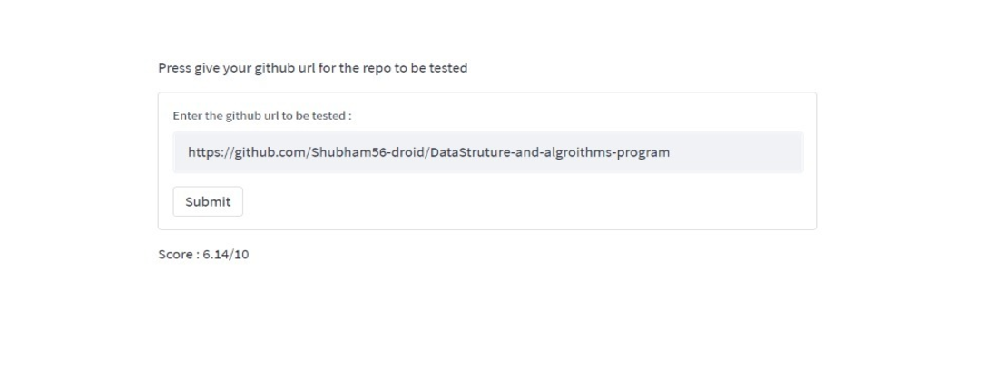
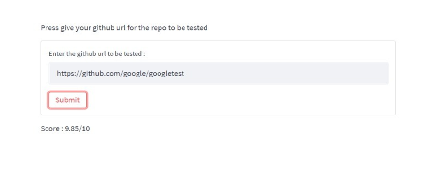

# Gitrep_Scorer

A Python application that scores GitHub repositories using TOPSIS (Technique for Order Preference by Similarity to an Ideal Solution) analysis. This tool helps developers and researchers evaluate the quality and popularity of GitHub repositories based on multiple criteria.

## 🎯 What Does This Project Do?

Gitrep_Scorer analyzes GitHub repositories by:
1. **Extracting repository data** from GitHub URLs (stars, forks, issues, commits, etc.)
2. **Comparing against a benchmark dataset** of 10,000+ repositories from Kaggle
3. **Applying TOPSIS analysis** to calculate a normalized score (0-1)
4. **Providing insights** about repository performance and ranking

## 📊 What is TOPSIS Analysis?

TOPSIS (Technique for Order Preference by Similarity to an Ideal Solution) is a multi-criteria decision analysis method that:

- **Identifies the best and worst solutions** from a set of alternatives
- **Calculates distances** from each alternative to the ideal and anti-ideal solutions
- **Ranks alternatives** based on their relative closeness to the ideal solution
- **Provides normalized scores** between 1 and 10 (higher is better)

### How TOPSIS Works in This Project:
1. **Criteria Selection**: Uses metrics like stars, forks, commits, issues, etc.
2. **Data Normalization**: Scales all values to a 0-1 range
3. **Weight Assignment**: Applies importance weights to different criteria
4. **Distance Calculation**: Measures how far each repo is from ideal/anti-ideal
5. **Score Computation**: Final score = (total repositories - rank) / total repositories × 10

## 📈 Dataset Information

The project uses a comprehensive dataset from Kaggle containing:
- **10,000+ GitHub repositories** with detailed metrics
- **Multiple criteria**: stars, forks, commits, issues, pull requests, etc.
- **Diverse repository types**: from small projects to large-scale applications
- **Time-series data**: captures repository evolution over time

This dataset serves as the benchmark for comparing and scoring new repositories.

## 🚀 Installation & Setup

### Prerequisites
- Python 3.12 or higher
- Git

### Step 1: Install uv (Python Package Manager)
If you don't have uv installed, run one of these commands:

**macOS/Linux:**
```bash
curl -LsSf https://astral.sh/uv/install.sh | sh
```

**Windows:**
```powershell
powershell -c "irm https://astral.sh/uv/install.ps1 | iex"
```

**Using pip:**
```bash
pip install uv
```

### Step 2: Clone and Setup the Project
```bash
# Clone the repository
git clone https://github.com/prateek11rai/Gitrep_Scorer.git
cd Gitrep_Scorer

# Install dependencies using uv
uv sync

# Activate the virtual environment
source .venv/bin/activate  # On macOS/Linux
# or
.venv\Scripts\activate     # On Windows
```

### Step 3: Run the Application
```bash
# Start the Streamlit application
uv run streamlit run main.py
```

The application will open in your default web browser at `http://localhost:8501`.

## 🎮 How to Use

1. **Enter Repository URL**: Paste any GitHub repository URL (e.g., `https://github.com/username/repo-name`)
2. **Click Analyze**: The system will fetch repository data and perform TOPSIS analysis
3. **View Results**: See the repository score and detailed analysis

## 📊 Expected Outputs

### 1. **Repository Score (1-10)**
- **8.0-10.0**: Excellent repository (top-tier)
- **6.0-8.0**: Very good repository
- **4.0-6.0**: Good repository
- **2.0-4.0**: Average repository
- **1.0-2.0**: Below average repository

### 2. **Detailed Metrics**
- **Stars**: Repository popularity indicator
- **Forks**: Community engagement measure
- **Issues**: Project activity and maintenance
- **Commits**: Development activity
- **Pull Requests**: Community contributions
- **Size**: Project complexity
- **Language**: Primary programming language

### 3. **Comparative Analysis**
- **Ranking**: Where the repository stands among similar projects
- **Benchmark Comparison**: Performance against the Kaggle dataset
- **Strengths/Weaknesses**: Key metrics analysis

### 4. **Visualizations**
- **Score Distribution**: How the repository compares to others
- **Metrics Breakdown**: Individual criterion performance
- **Trend Analysis**: Historical performance patterns

## 🛠️ Technology Stack

<p align="center">
 <a href="https://www.python.org/"></a>
 <a href="https://www.kaggle.com/"> </a>
 <a href="https://streamlit.io/"> </a>
 <a href="https://pandas.pydata.org/"></a>
 <a href="https://numpy.org/"></a>
</p>

## 📸 Screenshots

<p align="center">
 
 
</p>

## 🔧 Troubleshooting

### Common Issues:

1. **uv not found**: Make sure uv is installed and in your PATH
2. **Port already in use**: Change the port with `uv run streamlit run main.py --server.port 8502`
3. **GitHub API rate limit**: Wait a few minutes and try again
4. **Repository not found**: Ensure the GitHub URL is correct and the repository is public

### Alternative Installation (if uv doesn't work):
```bash
# Install dependencies manually
pip install streamlit pandas numpy requests beautifulsoup4

# Run the application
streamlit run main.py
```

## 🙏 Acknowledgments

- Dataset provided by [Kaggle](https://www.kaggle.com/)
- TOPSIS methodology for multi-criteria decision analysis
- GitHub API for repository data extraction
- Streamlit for the web interface
